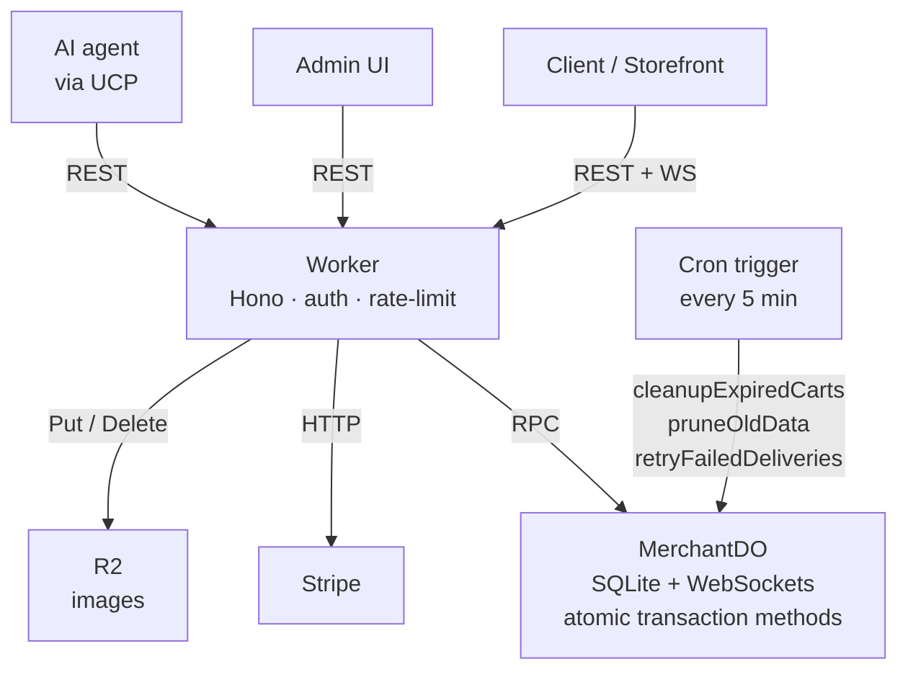

# merchant

**The open-source commerce backend for Cloudflare + Stripe. Bring a Stripe key. Start selling.**

[](https://github.com/armincerf/merchant/actions/workflows/ci.yml)
[](LICENSE)
[](https://www.typescriptlang.org/)

A lightweight, API-first backend for products, inventory, checkout, and orders — designed to run on Cloudflare Workers with Stripe handling payments.

## Quick Start

```bash
# 1. Clone & install
git clone https://github.com/armincerf/merchant
cd merchant && npm install

# 2. Initialize (creates API keys)
npx tsx scripts/init.ts

# 3. Start the API
npm run dev

# 4. Seed demo data (optional)
npx tsx scripts/seed.ts http://localhost:8787 sk_your_admin_key

# 5. Connect Stripe
curl -X POST http://localhost:8787/v1/setup/stripe \
  -H "Authorization: Bearer sk_your_admin_key" \
  -H "Content-Type: application/json" \
  -d '{"stripe_secret_key":"sk_test_..."}'

# 6. Admin dashboard
cd admin && npm install && npm run dev
```

## Deploy to Cloudflare

Durable Objects and R2 are **auto-provisioned** on first deploy — no manual setup required.

```bash
# Deploy (Durable Object + R2 bucket created automatically)
wrangler deploy

# Run init script against production
npx tsx scripts/init.ts --remote
```

## Architecture



**Source layout:**

```
src/
├── index.ts          # Entry point, route mounting, cron handler
├── do.ts             # MerchantDO: SQLite schema, atomic transaction methods, WebSocket hub
├── db.ts             # Thin RPC wrapper over the DO stub
├── types.ts          # Shared types, ApiError, VERSION
├── middleware/
│   ├── auth.ts       # API key + OAuth authentication
│   ├── rate-limit.ts # Per-endpoint sliding-window counters
│   └── idempotency.ts
└── routes/
    ├── catalog.ts    # Products & variants
    ├── checkout.ts   # Carts & Stripe checkout
    ├── orders.ts     # Order management
    ├── inventory.ts  # Stock levels
    ├── customers.ts  # Customer management
    ├── discounts.ts  # Discount codes (Stripe-synced)
    ├── analytics.ts  # Event tracking, summary, funnel
    ├── images.ts     # R2 image upload
    ├── keys.ts       # API key management
    ├── setup.ts      # Store configuration
    ├── webhooks.ts   # Stripe webhook receiver
    ├── webhooks-outbound.ts  # Outbound webhook endpoints
    ├── oauth.ts      # OAuth 2.0 + PKCE
    └── ucp.ts        # Universal Commerce Protocol
```

## Design & Scaling Model

Every request resolves `MERCHANT.idFromName('default')` — there is exactly one `MerchantDO` instance per deployment. This gives you:

- **Strong consistency.** All reads and writes go to a single SQLite database with no replication lag.
- **Serialized writes.** Cloudflare's `transactionSync` API makes multi-step mutations (cart item reservation, order finalization, inventory deduction) atomic without distributed transactions or optimistic-concurrency retries.
- **Zero infra.** No external database, cache, or message broker. The DO is the database and the WebSocket hub.

**Scale envelope.** The single DO is the deliberate ceiling of this design, so here it is honestly: Cloudflare's [Durable Objects limits](https://developers.cloudflare.com/durable-objects/platform/limits/) give an individual object a soft limit of ~1,000 requests/second, and their [Rules of Durable Objects](https://developers.cloudflare.com/durable-objects/best-practices/rules-of-durable-objects/) guidance pegs realistic capacity at 200–500 req/s when requests do storage writes — which checkout, analytics, and webhook traffic do. The DO also lives in one region, so shoppers on other continents pay cross-ocean latency on every uncached request, and a storefront traffic spike contends with checkout on the same single-threaded instance.

**Edge caching.** To keep browse traffic off the DO, public catalog reads (`GET /v1/products`, `GET /v1/products/:id`, `GET /v1/inventory/available`) are cached in each colo's [Cache API](https://developers.cloudflare.com/workers/runtime-apis/cache/) under keys that embed a version counter (`catalog_version` / `inventory_version` in the `config` table). SQLite triggers bump the counters on every write to the catalog and inventory tables, so any mutation — admin edit, checkout reservation, cron cleanup — rotates the cache key and the next read is fresh; the 60-second TTL is only a backstop. API-key auth lookups and the version counters are memoized per isolate (60s / 5s), so a cache hit costs zero DO round trips. Admin and OAuth reads always bypass the cache. Two caveats: the Cache API is a no-op on `*.workers.dev` (you need a custom domain to get caching; everything still works without it, just uncached), and a revoked public key can be honored for up to 60 seconds by isolates that already memoized it.

**When you outgrow it.** In order of effort:

1. **Multiple stores** — shard by store: replace `idFromName('default')` with `idFromName(storeId)` and each store gets its own isolated DO with the same consistency story.
2. **Hot auth/config reads** — move API-key lookups and the version counters to [Workers KV](https://developers.cloudflare.com/kv/) (write-through from the DO). KV is Cloudflare's blessed home for read-heavy config; accept its ~60s eventual consistency for key revocation.
3. **Analytics writes** — replace the per-pageview DO write with [Workers Analytics Engine](https://developers.cloudflare.com/analytics/analytics-engine/) `writeDataPoint()` (fire-and-forget, SQL query API) if 3-month retention and sampling are acceptable, or batch events through [Queues](https://developers.cloudflare.com/queues/) if you need an exact ledger.

Not worth doing: Smart Placement (it would centralize the Worker near the DO and defeat colo-local caching) and waiting for first-party DO read replicas (they don't exist; only D1 has read replication).

**Cron.** The Worker's `scheduled` handler runs every 5 minutes and calls three DO methods: `cleanupExpiredCarts`, `pruneOldData` (analytics events after 90 days, Stripe event records after 30 days, webhook deliveries after 30 days, idempotency keys after 24 hours), and `retryFailedDeliveries` (outbound webhook retries).

## Security Model

### API Key Roles

| Key prefix | Role | Access |
|---|---|---|
| `pk_...` | public | Create and read carts, public inventory availability, track analytics events |
| `sk_...` | admin | Full access to all endpoints |

Keys are stored as SHA-256 hashes. The plaintext key is shown **once** at creation — it cannot be recovered. Use `DELETE /v1/keys/{id}` to revoke; the last admin key cannot be deleted (prevents lockout).

### OAuth 2.0 + PKCE

Platforms and AI agents can act on behalf of customers using OAuth 2.0 authorization code flow with PKCE. Tokens authenticate the same `Authorization: Bearer` header as API keys — the middleware detects them by length/format (64-char hex = OAuth, otherwise API key).

Supported scopes: `openid`, `profile`, `checkout`, `orders.read`, `orders.write`, `addresses.read`, `addresses.write`, plus UCP-specific `ucp:scopes:checkout_session`, `ucp:scopes:order`, `ucp:scopes:identity`.

Discovery: `GET /.well-known/oauth-authorization-server`

### UCP Route Authentication

All `/ucp/v1/*` routes require authentication (any valid API key or OAuth token). The discovery endpoint `GET /.well-known/ucp` is public.

### Outbound Webhook Signatures

Every delivery includes:

| Header | Value |
|---|---|
| `X-Merchant-Signature` | `HMAC-SHA256(secret, rawBody)` as hex |
| `X-Merchant-Timestamp` | Unix seconds at delivery creation |
| `X-Merchant-Delivery-Id` | Unique delivery ID |

Rotate the secret with `POST /v1/webhooks/{id}/rotate-secret`.

### WebSocket Topic Authorization

Topics are checked at connection time and again at broadcast time (defense-in-depth):

- **Public** (any valid `pk_...` key, or no key): `inventory` / `inventory.updated`, `presence.product.<id>`
- **Admin only** (`sk_...` key required): `order`, `order.*`, `cart`, `cart.*`, `inventory.low`, `*`

Disallowed topics are silently dropped; non-admin sockets never receive order or cart events even if they hold such a topic.

### Rate Limiting

All `/v1/*` and `/oauth/*` routes are rate-limited. Limits are scoped per endpoint group (configurable in `src/config/rate-limits.ts`). Counters are in-memory, per-isolate — they reset when the isolate recycles. For sustained high traffic a durable rate-limiting solution (Cloudflare Rate Limiting API or a KV-backed counter) would be more robust.

Response headers: `X-RateLimit-Limit`, `X-RateLimit-Remaining`, `X-RateLimit-Reset`.

### Idempotency

Three mutation endpoints accept an `Idempotency-Key` header for safe retries:

- `POST /v1/carts`
- `POST /v1/carts/{id}/checkout`
- `POST /v1/orders/{id}/refund`

Semantics: same key + same body → cached response replayed (`Idempotency-Replayed: true`); same key + different body → `409 idempotency_conflict`; request still in flight → `409 idempotency_in_flight`. Keys are scoped per API key and expire after 24 hours.

## Guides

- [docs/storefront.md](docs/storefront.md) — Building a storefront: products, cart, checkout, live inventory WebSocket
- [docs/webhooks.md](docs/webhooks.md) — Outbound webhooks: subscribing, event catalog, signature verification, retry semantics
- [docs/oauth-ucp.md](docs/oauth-ucp.md) — OAuth 2.0 + PKCE flow and the Universal Commerce Protocol checkout session API
- [docs/deployment.md](docs/deployment.md) — Deploying to Cloudflare, initializing keys, Stripe configuration, R2 setup

## API Reference

All endpoints require `Authorization: Bearer <key>` except where noted.

Interactive docs are served at `/docs` (Swagger UI backed by `/openapi.json`).

### Products (admin)

```bash
GET    /v1/products?limit=20&cursor=...&status=active
GET    /v1/products/{id}
POST   /v1/products
PATCH  /v1/products/{id}
DELETE /v1/products/{id}          # fails if variants have been ordered

POST   /v1/products/{id}/variants
PATCH  /v1/products/{id}/variants/{variantId}
DELETE /v1/products/{id}/variants/{variantId}

POST   /v1/products/{id}/images
DELETE /v1/products/{id}/images/{imageId}
```

### Inventory

```bash
# Public — no auth required
GET  /v1/inventory/available?skus=SKU1,SKU2   # on_hand - reserved for each SKU

# Admin
GET  /v1/inventory?limit=100&cursor=...&low_stock=true
GET  /v1/inventory?sku=TEE-BLK-M              # single SKU lookup
POST /v1/inventory/{sku}/adjust
     {"delta": 100, "reason": "restock"}
     # reason: restock | correction | damaged | return
```

### Checkout (public key sufficient)

```bash
POST /v1/carts                     # {"customer_email": "buyer@example.com"}
GET  /v1/carts/{id}
POST /v1/carts/{id}/items          # replaces all items: {"items":[{"sku":"...","qty":2}]}
POST /v1/carts/{id}/items/add      # incremental add/remove (positive/negative qty)
POST /v1/carts/{id}/apply-discount # {"code": "SUMMER20"}
DELETE /v1/carts/{id}/discount

POST /v1/carts/{id}/checkout
{
  "success_url": "https://...",
  "cancel_url":  "https://...",
  "collect_shipping": true,
  "shipping_countries": ["US", "CA", "GB"]
}
# Returns a Stripe Checkout URL. Stripe Tax is enabled automatically.
```

Carts expire 30 minutes after creation (extended to 60 minutes once checkout is initiated; the Stripe Checkout Session is created with the same expiry, so a session can never outlive its cart).

### Orders (admin)

```bash
GET    /v1/orders?limit=20&cursor=...&status=shipped&email=customer@example.com
GET    /v1/orders/{id}
PATCH  /v1/orders/{id}             # {"status":"shipped","tracking_number":"...","tracking_url":"..."}
POST   /v1/orders/{id}/refund      # {"amount_cents": 1000}  # omit for full refund
POST   /v1/orders/test             # create test order (skips Stripe, for development)
```

**Order statuses:** `pending` → `paid` → `processing` → `shipped` → `delivered` | `refunded` | `canceled`

### Customers (admin)

```bash
GET    /v1/customers?limit=20&cursor=...&search=john@example.com
GET    /v1/customers/{id}
GET    /v1/customers/{id}/orders
PATCH  /v1/customers/{id}
POST   /v1/customers/{id}/addresses
DELETE /v1/customers/{id}/addresses/{addressId}
```

Customers are auto-created from Stripe checkout sessions.

### Discounts (admin)

```bash
GET    /v1/discounts?limit=20&cursor=...
GET    /v1/discounts/{id}
POST   /v1/discounts              # {"code":"SUMMER20","type":"percentage","value":20}
PATCH  /v1/discounts/{id}
DELETE /v1/discounts/{id}         # deactivates, does not hard-delete
```

Discounts sync to Stripe coupons and promotion codes when Stripe is configured. Percentage discounts with `max_discount_cents` set are not synced to Stripe (Stripe does not support a capped percentage coupon).

### Analytics (admin summary/funnel; public key for event tracking)

```bash
POST /v1/analytics/events          # track event (pk_ or sk_ key)
# {"event_type":"product_view","session_id":"...","page_path":"/products/x"}
# event_type: page_view | product_view | add_to_cart | checkout_started | order_completed
# Bot requests are silently dropped (204 returned).

GET  /v1/analytics/summary?period=30d   # admin only; period: 7d | 30d | 90d
GET  /v1/analytics/funnel?period=30d    # admin only
```

### Images (admin)

```bash
POST   /v1/images          # multipart/form-data; field: file
GET    /v1/images/{key}    # redirects to R2 URL
DELETE /v1/images/{key}
```

### API Keys (admin)

```bash
GET    /v1/keys
POST   /v1/keys            # {"role": "public"}  or  {"role": "admin"}
DELETE /v1/keys/{id}       # refuses to delete last admin key
```

### Setup (admin)

```bash
POST /v1/setup/init    # create initial keys (only works if no keys exist)
POST /v1/setup/stripe  # {"stripe_secret_key":"sk_...","stripe_webhook_secret":"whsec_..."}
```

### Outbound Webhooks (admin)

```bash
GET    /v1/webhooks
POST   /v1/webhooks
       {"url": "https://your-server.com/webhook", "events": ["order.created"]}
GET    /v1/webhooks/{id}          # includes recent deliveries
PATCH  /v1/webhooks/{id}          # {"events":["*"],"status":"paused"}
DELETE /v1/webhooks/{id}
POST   /v1/webhooks/{id}/rotate-secret
GET    /v1/webhooks/{id}/deliveries/{deliveryId}
POST   /v1/webhooks/{id}/deliveries/{deliveryId}/retry
```

**Supported events:** `order.created`, `order.updated`, `order.shipped`, `order.refunded`, `inventory.low`

**Wildcards:** `order.*` or `*`

**Delivery semantics:** at-least-once. 3 immediate attempts (exponential backoff), then cron retries every 5 minutes for deliveries that are still failing, up to **9 total cumulative attempts**. After 9 attempts or 24 hours, automatic retries stop. Manual retry via the retry endpoint is rejected once the cap is reached.

### Stripe Webhooks

```bash
POST /v1/webhooks/stripe    # set this as your Stripe webhook URL
```

Events handled: `checkout.session.completed` → creates order, deducts inventory; `checkout.session.expired` → releases reserved inventory and discount usage for abandoned checkouts. Configure your Stripe webhook endpoint to send both.

If a `checkout.session.completed` arrives for a cart whose reservation was already released (lost webhook + cron fallback), no order is created: the payment is automatically refunded, recorded in the `payment_anomalies` table, and an `order.failed` webhook is dispatched.

```bash
# Local development
stripe listen --forward-to localhost:8787/v1/webhooks/stripe
```

### Real-time Updates (WebSocket)

Authenticate with `Authorization: Bearer <key>` (server-to-server) or `?key=<key>` (browsers, which cannot set custom WS headers).

```javascript
// Public: inventory + presence
const ws = new WebSocket('wss://your-store.com/?topics=inventory,presence.product.prod_123&key=pk_...');

// Admin: all events
const ws = new WebSocket('wss://your-store.com/?topics=*&key=sk_...');

ws.onmessage = ({ data }) => {
  const { type, data: payload, timestamp } = JSON.parse(data);
};

// Subscribe/unsubscribe after connecting
ws.send(JSON.stringify({ action: 'subscribe',   topic: 'order' }));
ws.send(JSON.stringify({ action: 'unsubscribe', topic: 'inventory' }));
```

**Event types:** `cart.updated`, `cart.checked_out`, `order.created`, `order.updated`, `order.shipped`, `order.refunded`, `inventory.updated`, `inventory.low`, `presence.count`

### UCP (Universal Commerce Protocol)

Implements [UCP](https://ucp.dev) for AI agent-to-commerce interoperability.

```bash
GET    /.well-known/ucp                              # public — discovery
POST   /ucp/v1/checkout-sessions                     # requires auth
GET    /ucp/v1/checkout-sessions/:id
PUT    /ucp/v1/checkout-sessions/:id
POST   /ucp/v1/checkout-sessions/:id/complete
DELETE /ucp/v1/checkout-sessions/:id
```

Capabilities: `dev.ucp.shopping.checkout`, `dev.ucp.common.identity_linking`, `dev.ucp.shopping.order`

### OAuth 2.0

```bash
GET  /.well-known/oauth-authorization-server         # discovery
GET  /oauth/authorize                                # start flow (PKCE required)
POST /oauth/authorize                                # submit email
GET  /oauth/verify                                   # magic link callback
POST /oauth/token                                    # exchange code or refresh
POST /oauth/revoke                                   # revoke token
```

## Development

```bash
npm run typecheck   # tsc --noEmit
npm run lint        # Biome check
npm run lint:fix    # Biome check --write
npm test            # vitest run (via vitest-pool-workers)
npm run dev         # wrangler dev
```

Tests run inside a real `workerd` runtime via `@cloudflare/vitest-pool-workers` — the same runtime Cloudflare uses in production. This means tests exercise the actual Durable Object, SQLite layer, and WebSocket behavior, not mocks.

CI runs typecheck, lint, and tests on every push and pull request (see `.github/workflows/ci.yml`).

## Admin Dashboard & Example Store

```bash
# Admin dashboard (connect with sk_... key)
cd admin && npm install && npm run dev

# Vanilla JS example storefront (connect with pk_... key)
cd example && npm run dev
# Copy example/src/api.example.js to api.js and set your public key, then open http://localhost:3000
```

## Stack

| Component | Technology |
|---|---|
| Runtime | Cloudflare Workers |
| Framework | Hono + @hono/zod-openapi |
| Database | Durable Objects (SQLite) |
| Real-time | WebSocket (DO native) |
| Images | Cloudflare R2 |
| Payments | Stripe |
| Tests | vitest-pool-workers |
| Lint / Format | Biome |

## Migrating from D1

If you're upgrading from an older version that used D1:

```bash
# 1. Export D1 data
npx tsx scripts/migrate-d1-to-do.ts export --remote --db=merchant-db

# 2. Deploy new DO-based version
wrangler deploy

# 3. Initialize new API keys
npx tsx scripts/init.ts --remote

# 4. Import data
npx tsx scripts/migrate-d1-to-do.ts import --file=d1-export-xxx.json --url=https://your-store.workers.dev --key=sk_...
```

Products, variants, inventory, and discounts are imported. Orders are exported for reference but not re-imported. API keys and OAuth tokens must be regenerated.

## License

MIT
